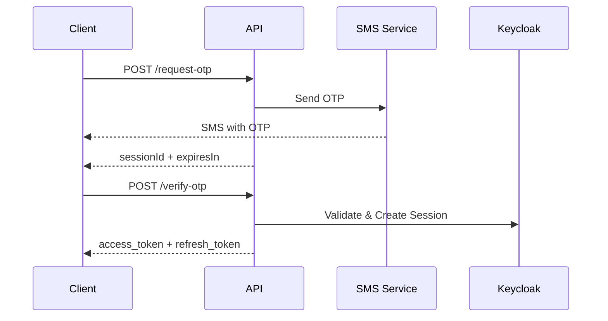

# Phone Authentication API Documentation

## Overview

The Phone Authentication API provides RESTful endpoints for headless/API-based phone number and OTP authentication. This enables mobile apps, SPAs, and other non-browser clients to authenticate users via SMS OTP.

## Base URL

```
https://{keycloak-domain}/realms/{realm-name}/phone-auth
```

## Authentication Flow

The phone authentication flow consists of three steps:

1. **Request OTP** - User provides phone number, system sends OTP via SMS
2. **Verify OTP** - User provides OTP code, system validates and returns access token
3. **Resend OTP** (optional) - User can request OTP to be resent if not received



## API Endpoints

### 1. Request OTP

Initiates the authentication flow by sending an OTP to the provided phone number.

**Endpoint:** `POST /phone-auth/request-otp`

**Request Headers:**
```
Content-Type: application/json
```

**Request Body:**
```json
{
  "phone": "9876543210",
  "regionPrefix": "+91",
  "clientId": "my-mobile-app"
}
```

**Parameters:**

| Field | Type | Required | Description |
|-------|------|----------|-------------|
| phone | string | Yes | Phone number without country code |
| regionPrefix | string | Yes | Country code with + prefix (e.g., +91 for India) |
| clientId | string | No | OAuth2 client ID (optional) |

**Success Response (200):**
```json
{
  "success": true,
  "sessionId": "550e8400-e29b-41d4-a716-446655440000",
  "phoneNumber": "+919876543210",
  "expiresIn": 600,
  "message": "OTP sent successfully"
}
```

**Error Response (400):**
```json
{
  "success": false,
  "error": "Invalid phone number format",
  "errorCode": "INVALID_PHONE_FORMAT"
}
```

**Error Codes:**

| Code | Description |
|------|-------------|
| INVALID_REQUEST | Request body is malformed |
| PHONE_REQUIRED | Phone number is missing |
| REGION_REQUIRED | Region prefix is missing |
| INVALID_PHONE_FORMAT | Phone number format is invalid |
| RATE_LIMIT_EXCEEDED | Too many requests from this phone number |
| SMS_SEND_FAILED | Failed to send SMS |
| INTERNAL_ERROR | Internal server error |

**Rate Limiting:**
- Maximum 3 requests per phone number per minute
- Returns `RATE_LIMIT_EXCEEDED` error when exceeded

---

### 2. Verify OTP

Validates the OTP code and returns authentication tokens.

**Endpoint:** `POST /phone-auth/verify-otp`

**Request Headers:**
```
Content-Type: application/json
```

**Request Body:**
```json
{
  "sessionId": "550e8400-e29b-41d4-a716-446655440000",
  "code": "123456"
}
```

**Parameters:**

| Field | Type | Required | Description |
|-------|------|----------|-------------|
| sessionId | string | Yes | Session ID from request-otp response |
| code | string | Yes | 6-digit OTP code received via SMS |

**Success Response (200):**
```json
{
  "success": true,
  "accessToken": "eyJhbGciOiJSUzI1NiIsInR5cCI6IkpXVCJ9...",
  "refreshToken": "eyJhbGciOiJIUzI1NiIsInR5cCI6IkpXVCJ9...",
  "tokenType": "Bearer",
  "expiresIn": 300
}
```

**Error Response (401):**
```json
{
  "success": false,
  "error": "Invalid OTP code",
  "errorCode": "INVALID_OTP",
  "remainingAttempts": 4
}
```

**Error Codes:**

| Code | Description |
|------|-------------|
| SESSION_NOT_FOUND | Session ID not found or expired |
| SESSION_EXPIRED | Session has timed out (10 minutes) |
| SESSION_LOCKED | Too many failed verification attempts |
| MAX_ATTEMPTS_REACHED | Maximum verification attempts reached (5) |
| INVALID_OTP | OTP code is incorrect |
| USER_DISABLED | User account is disabled |
| TOKEN_GENERATION_FAILED | Failed to generate authentication tokens |
| INTERNAL_ERROR | Internal server error |

**Security Features:**
- Maximum 5 verification attempts per session
- Session locks after 5 failed attempts
- Session expires after 10 minutes
- IP address validation (optional)

---

### 3. Resend OTP

Resends the OTP to the same phone number for an active session.

**Endpoint:** `POST /phone-auth/resend-otp`

**Request Headers:**
```
Content-Type: application/json
```

**Request Body:**
```json
{
  "sessionId": "550e8400-e29b-41d4-a716-446655440000"
}
```

**Parameters:**

| Field | Type | Required | Description |
|-------|------|----------|-------------|
| sessionId | string | Yes | Session ID from request-otp response |

**Success Response (200):**
```json
{
  "success": true,
  "sessionId": "550e8400-e29b-41d4-a716-446655440000",
  "phoneNumber": "+919876543210",
  "expiresIn": 600,
  "message": "OTP sent successfully"
}
```

**Error Response (400):**
```json
{
  "success": false,
  "error": "Maximum resend limit reached",
  "errorCode": "RESEND_LIMIT_EXCEEDED"
}
```

**Error Codes:**

| Code | Description |
|------|-------------|
| SESSION_ID_REQUIRED | Session ID is missing |
| SESSION_NOT_FOUND | Session ID not found or expired |
| RESEND_LIMIT_EXCEEDED | Maximum resend attempts reached (3) |
| SMS_SEND_FAILED | Failed to send SMS |
| INTERNAL_ERROR | Internal server error |

**Rate Limiting:**
- Maximum 3 resend attempts per session
- Session expiry extends by 10 minutes on each resend

---

### 4. Get Supported Countries

Returns list of supported country codes for phone authentication.

**Endpoint:** `GET /phone-auth/countries`

**Success Response (200):**
```json
[
  {
    "label": "India",
    "code": "+91"
  },
  {
    "label": "United States",
    "code": "+1"
  }
]
```

---

### 5. Health Check

Checks if the phone authentication service is operational.

**Endpoint:** `GET /phone-auth/health`

**Success Response (200):**
```json
{
  "status": "UP",
  "service": "phone-auth"
}
```

---

## Client Implementation Examples

### JavaScript (Fetch API)

```javascript
const KEYCLOAK_URL = 'https://auth.example.com';
const REALM = 'my-realm';

// Step 1: Request OTP
async function requestOtp(phone, regionPrefix) {
  const response = await fetch(
    `${KEYCLOAK_URL}/realms/${REALM}/phone-auth/request-otp`,
    {
      method: 'POST',
      headers: { 'Content-Type': 'application/json' },
      body: JSON.stringify({ phone, regionPrefix, clientId: 'my-app' })
    }
  );
  
  const data = await response.json();
  if (data.success) {
    return data.sessionId;
  } else {
    throw new Error(data.error);
  }
}

// Step 2: Verify OTP
async function verifyOtp(sessionId, code) {
  const response = await fetch(
    `${KEYCLOAK_URL}/realms/${REALM}/phone-auth/verify-otp`,
    {
      method: 'POST',
      headers: { 'Content-Type': 'application/json' },
      body: JSON.stringify({ sessionId, code })
    }
  );
  
  const data = await response.json();
  if (data.success) {
    // Store tokens
    localStorage.setItem('access_token', data.accessToken);
    localStorage.setItem('refresh_token', data.refreshToken);
    return data;
  } else {
    throw new Error(data.error);
  }
}

// Usage
try {
  const sessionId = await requestOtp('9876543210', '+91');
  const tokens = await verifyOtp(sessionId, '123456');
  console.log('Authenticated successfully!');
} catch (error) {
  console.error('Authentication failed:', error.message);
}
```

### Python (Requests)

```python
import requests

KEYCLOAK_URL = 'https://auth.example.com'
REALM = 'my-realm'

# Step 1: Request OTP
def request_otp(phone: str, region_prefix: str) -> str:
    response = requests.post(
        f'{KEYCLOAK_URL}/realms/{REALM}/phone-auth/request-otp',
        json={
            'phone': phone,
            'regionPrefix': region_prefix,
            'clientId': 'my-app'
        }
    )
    
    data = response.json()
    if data['success']:
        return data['sessionId']
    else:
        raise Exception(data['error'])

# Step 2: Verify OTP
def verify_otp(session_id: str, code: str) -> dict:
    response = requests.post(
        f'{KEYCLOAK_URL}/realms/{REALM}/phone-auth/verify-otp',
        json={
            'sessionId': session_id,
            'code': code
        }
    )
    
    data = response.json()
    if data['success']:
        return data
    else:
        raise Exception(data['error'])

# Usage
try:
    session_id = request_otp('9876543210', '+91')
    tokens = verify_otp(session_id, '123456')
    print(f"Access Token: {tokens['accessToken']}")
except Exception as e:
    print(f"Authentication failed: {e}")
```

### Swift (iOS)

```swift
import Foundation

class PhoneAuthService {
    let keycloakURL = "https://auth.example.com"
    let realm = "my-realm"
    
    // Step 1: Request OTP
    func requestOtp(phone: String, regionPrefix: String, completion: @escaping (Result<String, Error>) -> Void) {
        let url = URL(string: "\(keycloakURL)/realms/\(realm)/phone-auth/request-otp")!
        var request = URLRequest(url: url)
        request.httpMethod = "POST"
        request.setValue("application/json", forHTTPHeaderField: "Content-Type")
        
        let body = [
            "phone": phone,
            "regionPrefix": regionPrefix,
            "clientId": "my-ios-app"
        ]
        request.httpBody = try? JSONSerialization.data(withJSONObject: body)
        
        URLSession.shared.dataTask(with: request) { data, response, error in
            if let error = error {
                completion(.failure(error))
                return
            }
            
            guard let data = data,
                  let json = try? JSONSerialization.jsonObject(with: data) as? [String: Any],
                  let success = json["success"] as? Bool,
                  success,
                  let sessionId = json["sessionId"] as? String else {
                completion(.failure(NSError(domain: "PhoneAuth", code: -1)))
                return
            }
            
            completion(.success(sessionId))
        }.resume()
    }
    
    // Step 2: Verify OTP
    func verifyOtp(sessionId: String, code: String, completion: @escaping (Result<[String: Any], Error>) -> Void) {
        let url = URL(string: "\(keycloakURL)/realms/\(realm)/phone-auth/verify-otp")!
        var request = URLRequest(url: url)
        request.httpMethod = "POST"
        request.setValue("application/json", forHTTPHeaderField: "Content-Type")
        
        let body = ["sessionId": sessionId, "code": code]
        request.httpBody = try? JSONSerialization.data(withJSONObject: body)
        
        URLSession.shared.dataTask(with: request) { data, response, error in
            if let error = error {
                completion(.failure(error))
                return
            }
            
            guard let data = data,
                  let json = try? JSONSerialization.jsonObject(with: data) as? [String: Any],
                  let success = json["success"] as? Bool,
                  success else {
                completion(.failure(NSError(domain: "PhoneAuth", code: -1)))
                return
            }
            
            completion(.success(json))
        }.resume()
    }
}
```

### Kotlin (Android)

```kotlin
import kotlinx.coroutines.*
import okhttp3.*
import okhttp3.MediaType.Companion.toMediaType
import okhttp3.RequestBody.Companion.toRequestBody
import org.json.JSONObject

class PhoneAuthService {
    private val keycloakUrl = "https://auth.example.com"
    private val realm = "my-realm"
    private val client = OkHttpClient()
    
    // Step 1: Request OTP
    suspend fun requestOtp(phone: String, regionPrefix: String): String = withContext(Dispatchers.IO) {
        val json = JSONObject().apply {
            put("phone", phone)
            put("regionPrefix", regionPrefix)
            put("clientId", "my-android-app")
        }
        
        val body = json.toString()
            .toRequestBody("application/json".toMediaType())
        
        val request = Request.Builder()
            .url("$keycloakUrl/realms/$realm/phone-auth/request-otp")
            .post(body)
            .build()
        
        val response = client.newCall(request).execute()
        val responseJson = JSONObject(response.body?.string() ?: "")
        
        if (responseJson.getBoolean("success")) {
            responseJson.getString("sessionId")
        } else {
            throw Exception(responseJson.getString("error"))
        }
    }
    
    // Step 2: Verify OTP
    suspend fun verifyOtp(sessionId: String, code: String): JSONObject = withContext(Dispatchers.IO) {
        val json = JSONObject().apply {
            put("sessionId", sessionId)
            put("code", code)
        }
        
        val body = json.toString()
            .toRequestBody("application/json".toMediaType())
        
        val request = Request.Builder()
            .url("$keycloakUrl/realms/$realm/phone-auth/verify-otp")
            .post(body)
            .build()
        
        val response = client.newCall(request).execute()
        val responseJson = JSONObject(response.body?.string() ?: "")
        
        if (responseJson.getBoolean("success")) {
            responseJson
        } else {
            throw Exception(responseJson.getString("error"))
        }
    }
}

// Usage
lifecycleScope.launch {
    try {
        val sessionId = authService.requestOtp("9876543210", "+91")
        val tokens = authService.verifyOtp(sessionId, "123456")
        val accessToken = tokens.getString("accessToken")
        // Store tokens securely
    } catch (e: Exception) {
        Log.e("PhoneAuth", "Authentication failed", e)
    }
}
```

---

## Security Considerations

### Rate Limiting
- **Phone Number Level**: Maximum 3 OTP requests per minute per phone number
- **Session Level**: Maximum 3 OTP resends per session
- **Verification Attempts**: Maximum 5 OTP verification attempts per session

### Session Management
- Sessions are stored in Keycloak's distributed cache (cluster-safe)
- Sessions expire after 10 minutes
- Sessions are locked after 5 failed verification attempts
- Sessions extend expiry on OTP resend

### IP Address Tracking
- Client IP addresses are logged for security auditing
- Optional IP validation can be enabled to prevent session hijacking

### Token Security
- Access tokens expire based on Keycloak client configuration (typically 5-15 minutes)
- Refresh tokens can be used to obtain new access tokens
- Use HTTPS in production to protect tokens in transit

### Best Practices
1. Always use HTTPS in production
2. Store tokens securely (Keychain on iOS, KeyStore on Android)
3. Implement exponential backoff for retry logic
4. Handle rate limiting gracefully with user-friendly messages
5. Clear tokens on logout
6. Validate token expiry before API calls

---

## Error Handling

### Common Error Patterns

```javascript
async function handlePhoneAuth(phone, regionPrefix, otpCode) {
  try {
    // Request OTP
    const sessionId = await requestOtp(phone, regionPrefix);
    
    // Verify OTP
    const tokens = await verifyOtp(sessionId, otpCode);
    
    return tokens;
    
  } catch (error) {
    // Handle specific error codes
    switch (error.errorCode) {
      case 'RATE_LIMIT_EXCEEDED':
        showError('Too many attempts. Please try again in 1 minute.');
        break;
      case 'INVALID_PHONE_FORMAT':
        showError('Please enter a valid phone number.');
        break;
      case 'INVALID_OTP':
        showError(`Invalid code. ${error.remainingAttempts} attempts remaining.`);
        break;
      case 'SESSION_EXPIRED':
        showError('Session expired. Please request a new code.');
        break;
      case 'SESSION_LOCKED':
        showError('Too many failed attempts. Please try again later.');
        break;
      default:
        showError('Authentication failed. Please try again.');
    }
  }
}
```

---

## Testing

### Using cURL

```bash
# 1. Request OTP
curl -X POST https://auth.example.com/realms/my-realm/phone-auth/request-otp \
  -H "Content-Type: application/json" \
  -d '{
    "phone": "9876543210",
    "regionPrefix": "+91",
    "clientId": "test-client"
  }'

# Response: {"success":true,"sessionId":"xxx-xxx-xxx","phoneNumber":"+919876543210","expiresIn":600}

# 2. Verify OTP
curl -X POST https://auth.example.com/realms/my-realm/phone-auth/verify-otp \
  -H "Content-Type: application/json" \
  -d '{
    "sessionId": "xxx-xxx-xxx",
    "code": "123456"
  }'

# Response: {"success":true,"accessToken":"eyJ...","refreshToken":"eyJ...","expiresIn":300}

# 3. Resend OTP
curl -X POST https://auth.example.com/realms/my-realm/phone-auth/resend-otp \
  -H "Content-Type: application/json" \
  -d '{
    "sessionId": "xxx-xxx-xxx"
  }'
```

### Postman Collection

Import the following collection for easy testing:

```json
{
  "info": {
    "name": "Keycloak Phone Auth API",
    "schema": "https://schema.getpostman.com/json/collection/v2.1.0/collection.json"
  },
  "variable": [
    {
      "key": "keycloak_url",
      "value": "https://auth.example.com"
    },
    {
      "key": "realm",
      "value": "my-realm"
    }
  ],
  "item": [
    {
      "name": "Request OTP",
      "request": {
        "method": "POST",
        "url": "{{keycloak_url}}/realms/{{realm}}/phone-auth/request-otp",
        "header": [{"key": "Content-Type", "value": "application/json"}],
        "body": {
          "mode": "raw",
          "raw": "{\n  \"phone\": \"9876543210\",\n  \"regionPrefix\": \"+91\"\n}"
        }
      }
    }
  ]
}
```

---

## Migration Guide

### For Existing Browser Flow Users

The API maintains full compatibility with existing browser-based authentication flows. Both can coexist:

- **Browser Flow**: Uses FreeMarker templates and form submissions
- **API Flow**: Uses REST endpoints and returns JSON

No changes are required to existing browser flows.

---

## Support

For issues, questions, or feature requests:
- Email: dev@ssegning.com
- GitHub: https://github.com/vymalo/keycloak-phone-number
